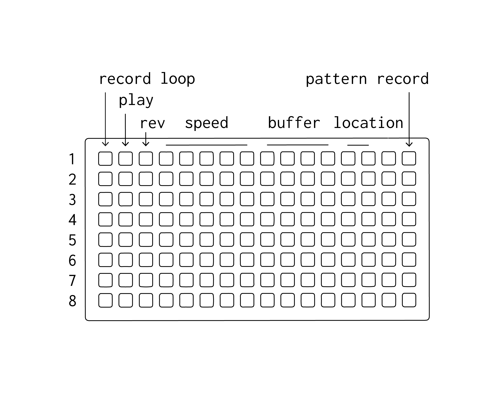

# anachronsim

8 voice x 8 minute digital tape looping interface for grids + max for live. speaks to other devices in `prosidy` through `diction`.

### Requirements

[Ableton Live](https://www.ableton.com/en/live/)

[Max for Live](https://www.ableton.com/en/live/max-for-live/)

[128 or 64 grid](https://monome.org/)

### first steps

1.  open a live set, drop anachronsim.amxd in an audio track and record enanable the track.

2.  select your 128 grid from the dropdown on anaphora

3.  press the top left key on the grid to create a loop. make a sound. press the top left key again to end recording.

4. recording while a channel is not playing results in a new loop.

5. speed controls both record and and play rate. hold two keys and release to glide - this is very expressive (!)

6. the next 4 keys select which buffer a voice reads/writes (either 1-4 or 5-8) (there are 8 buffers). using seprate voices to record to and pay back from buffer yields more options.

7. pattern record captures key presses on the grid. cyle through record > (press some other buttons) > playback > reset

8. on the standalone .amxd there are options for dry signal + voice levels, voice-wide overdub (for exporing delays), and voice-wide panning (width).

[download](https://github.com/AndrewShike/anaphora/anachronsim/master.zip)
